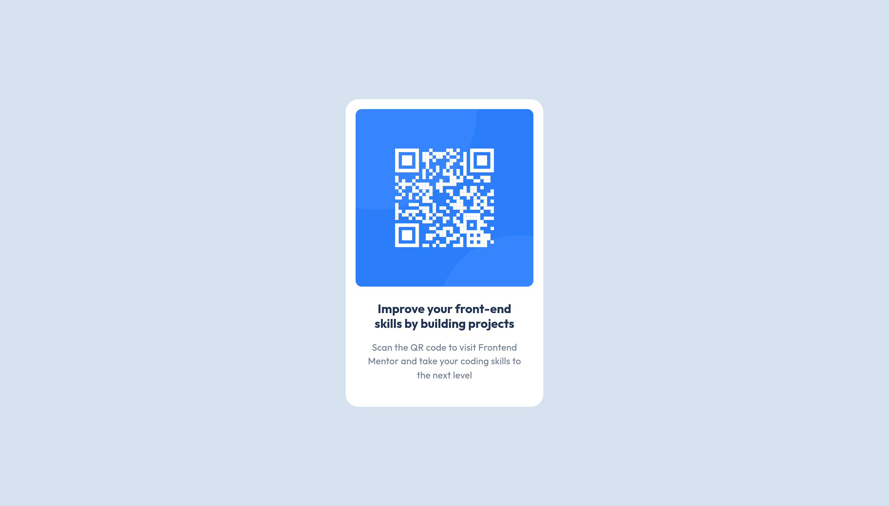

# Frontend Mentor - QR code component solution

This is a solution to the [QR code component challenge on Frontend Mentor](https://www.frontendmentor.io/challenges/qr-code-component-iux_sIO_H). Frontend Mentor challenges help you improve your coding skills by building realistic projects.

## Table of contents

- [Overview](#overview)
  - [Screenshot](#screenshot)
  - [Links](#links)
- [My process](#my-process)
  - [Built with](#built-with)
  - [What I learned](#what-i-learned)
  - [Continued development](#continued-development)
  - [Useful resources](#useful-resources)
  - [AI Collaboration](#ai-collaboration)
- [Author](#author)

## Overview

### Screenshot

### Links

- Solution URL: [Add solution URL here](https://your-solution-url.com)
- Live Site URL: [Add live site URL here](https://your-live-site-url.com)

## My process

### Built with

- Semantic HTML5 markup
- CSS custom properties
- Flexbox
- Self-hosted fonts using `@font-face`

### What I learned

This challenge helped me think more deliberately about semantic HTML — specifically when to use elements like `<main>`, `<article>`, and headings, and why those choices matter for accessibility and document structure.

On the CSS side, I practiced organizing styles into clear sections (reset, custom properties, layout, components), which made the stylesheet easier to read and maintain. I also got more comfortable with `@font-face` for self-hosted fonts and using `font-display: swap` for performance.

One specific thing I'll carry forward: using classes instead of element selectors (like `.card-content` instead of `.qr-code-card div`) to avoid unintended style leaking.

### Continued development

- **Git commits:** I want to write more descriptive, conventional commits. Right now my commit messages need more discipline and consistency.
- **Semantic HTML decisions:** I still spend a lot of time deciding which element fits best in a given context. I plan to build this intuition gradually through practice.
- **CSS confidence:** This project felt like a step forward with CSS. I want to keep building on that — next I'd like to get more comfortable with responsive design and CSS Grid.

### Useful resources

No external resources were needed for this project — I was already familiar with the concepts used. Any feedback on my semantic HTML choices or CSS structure is welcome.

### AI Collaboration

- **Tool used:** Claude (claude.ai)
- **How I used it:** Post-build code review. After completing the project independently, I shared my HTML and CSS for feedback on structure, best practices, and bugs.
- **What worked well:** Getting specific, direct feedback on issues I wouldn't have caught myself — like duplicated `@font-face` declarations, the `align-items` with no flex context, and why image `width`/`height` attributes matter for layout shift.
- **What didn't:** Not applicable — I used it strictly for review, not for building.

## Author

- Frontend Mentor - [@JusticeCodes00](https://www.frontendmentor.io/profile/JusticeCodes00)